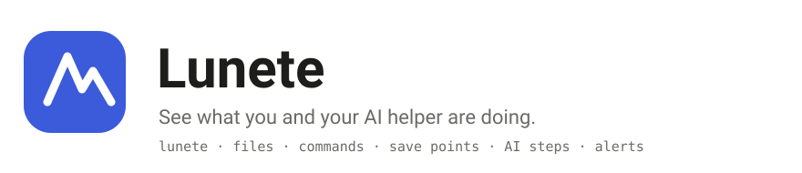

<div align="center">

<picture>
  <source media="(prefers-color-scheme: dark)" srcset="docs/img/banner-dark.svg">
  
</picture>

**A live, plain-English map of your project and everything your AI coding helper does in it.**

[](https://github.com/alexb-joat/hlidskjalv/actions/workflows/ci.yml)
[](https://github.com/alexb-joat/hlidskjalv/actions/workflows/codeql.yml)


[](LICENSE)

<sub><i>Hlidskjalv: Odin's high seat, from which he looks out over every realm. Here it looks out over one project.</i></sub>

</div>

<picture>
  <source media="(prefers-color-scheme: dark)" srcset="docs/img/live-dark.png">
  
</picture>

## What you get

| View | |
|---|---|
| **Live** | Your project as a map that lights up as files change, and a log of every edit, command, save point and AI step |
| **Replay** | Every session is saved on your computer; scrub through it step by step |
| **Learn** | Short levels, a command decoder and badges |
| **Details** | Click anything for the whole story: why a model was picked, tokens, cost, what each part of a command does |
| **Alerts** | Things you didn't do yourself: risky commands an AI ran, startup files that changed, refused requests, spending caps |

Made for people who are new to coding and work with an AI helper in VS Code. Hlidskjalv only **watches**: it never changes your files. A real terminal inside the page is there if you want it (`--terminal`).

## Start in 2 minutes

You need Python 3.10 or newer, and nothing else.

```bash
git clone https://github.com/alexb-joat/hlidskjalv.git && cd hlidskjalv
python3 -m hlidskjalv watch ~/projects/my-app
```

On Windows: `py -3 -m hlidskjalv watch C:\Users\you\projects\my-app`. Your browser opens at `http://127.0.0.1:8788`, and a short tour shows you around; leave the terminal running while you work. **Ctrl+C** stops it and saves the session for Replay. Point it at one project folder, not your whole home folder.

## Privacy

- **Local only:** it listens on `127.0.0.1` and makes no outbound connection unless you set one up.
- **File contents never leave:** only names and line counts; secret-looking files aren't read and secrets in commands are masked.
- **Read-only:** it never runs anything from your project; Git runs with hooks off.

## More

[Guide](docs/guide.md) (AI steps and cost, alerts, terminal, customizing, start at login) · [Pairing and sync](docs/pairing-and-sync.md) · [Security](docs/security.md) · [Changelog](CHANGELOG.md) · [Contributing](CONTRIBUTING.md) · Report a vulnerability via [SECURITY.md](SECURITY.md)

[MIT](LICENSE). Not affiliated with VS Code, Cline, Anthropic, OpenAI or Ollama.
